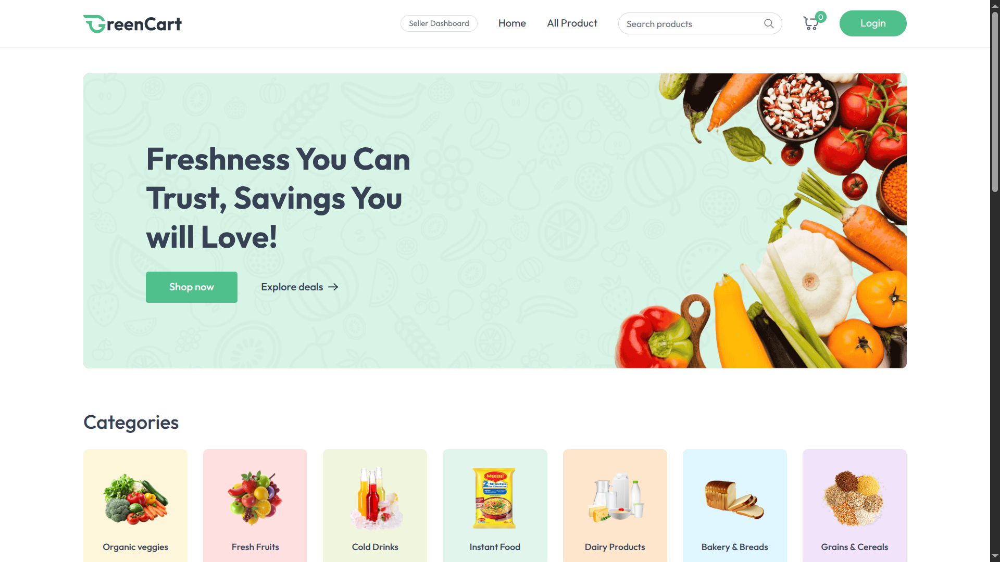
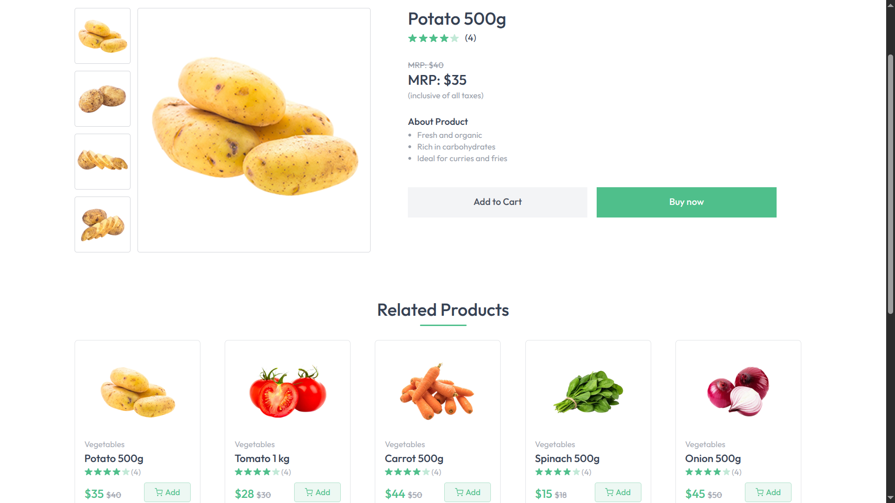

<h1 align="center">🍏 Grocery Store</h1>

<p align="center">
  A full-stack grocery shopping application built to practice real-world eCommerce features using modern web technologies.
  <br />
  <a href="https://grocery-store-shrid.vercel.app/" target="_blank"><strong>View Live Demo ➔</strong></a>
</p>

---

### 🖼️ Screenshots

#### 🏠 Home Page



#### 📦 Product Page



---

## ✨ Overview

This is a self-built grocery store application that allows users to:

* 🛋️ Browse and search for grocery items by category
* 🛒 Add products to cart with quantity control
* 💳 Checkout using Cash on Delivery or Stripe
* 📄 Manage saved addresses
* 💼 View past orders with real-time status

Built to solidify my understanding of the MERN stack (MongoDB, Express, React, Node.js), state management, payment integration, and API architecture.

---

## 🔧 Tech Stack

**Frontend :**
React, Tailwind CSS, React Router, React Hot Toast

**Backend :**
Node.js, Express, MongoDB, Mongoose, JWT, bcrypt, cookie-parser

**Other Tools :**
Cloudinary (image uploads), Stripe (payments), dotenv, Vercel (hosting)

---

## 📡 API Highlights

> Base URL: `/api`

### 🔑 Auth

* `POST /auth/register`
* `POST /auth/login`

### 🍒 Products

* `GET /product`
* `GET /product/:id`

### 🛒 Cart

* `POST /cart/add`
* `PUT /cart/update`
* `DELETE /cart/remove/:id`

### 💼 Orders

* `POST /order/cod`
* `POST /order/stripe`
* `GET /order/user?userId=xyz`

### 🏠 Address

* `POST /address/add`
* `GET /address/user/:id`
* `DELETE /address/:id`

---

## 📅 Folder Structure

```
grocery-store/
├── client/      # React frontend
│   └── pages/   # Home, Cart, Login, Orders, etc.
├── server/      # Express backend
│   ├── routes/
│   ├── controllers/
│   ├── models/
│   └── configs/
```

---

## 🚀 Setup Instructions

### 🔍 Prerequisites

* Node.js v16+
* MongoDB Atlas or local instance
* Stripe test keys

### 📚 Clone & Install

```bash
git clone https://github.com/shridmishra/grocery-store.git
cd grocery-store
```

#### Backend

```bash
cd server
npm install
cp .env.example .env
# Fill in your MongoDB, JWT, Cloudinary, and Stripe keys
npm run server
```

#### Frontend

```bash
cd ../client
npm install
npm run dev
```

Open your browser at `http://localhost:3000`

---

## 🔢 Sample Environment Variables

```env
# server/.env
PORT=5000
MONGODB_URI=your_mongo_uri
JWT_SECRET=your_jwt_secret
CLOUDINARY_NAME=your_cloudinary_name
CLOUDINARY_API_KEY=your_cloudinary_key
CLOUDINARY_API_SECRET=your_cloudinary_secret
STRIPE_SECRET_KEY=your_stripe_secret
```

---


## 😊 Notes

This project was built for learning and showcasing end-to-end MERN app development, payment flow integration, and clean UI/UX practices.

If you find bugs or have suggestions, feel free to fork it and tinker for your own learning.
